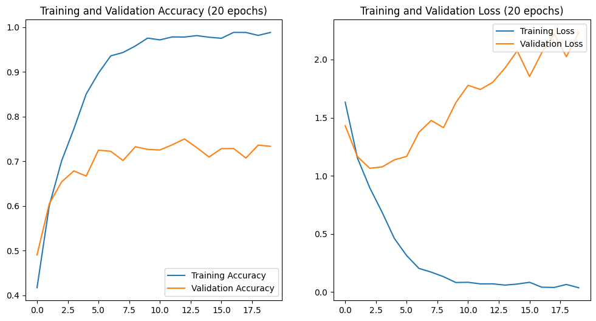
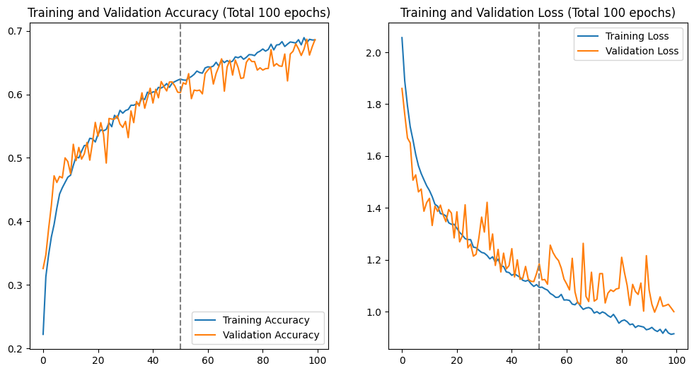
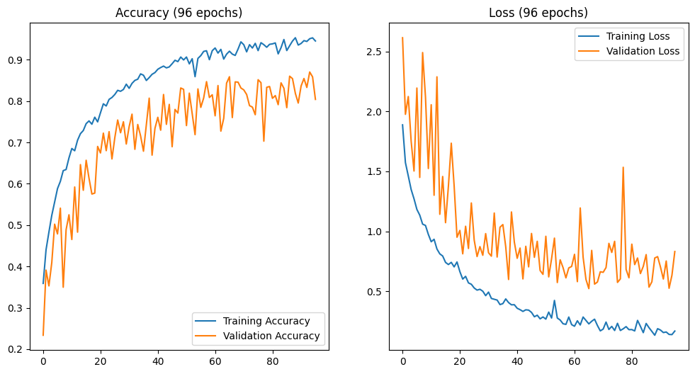
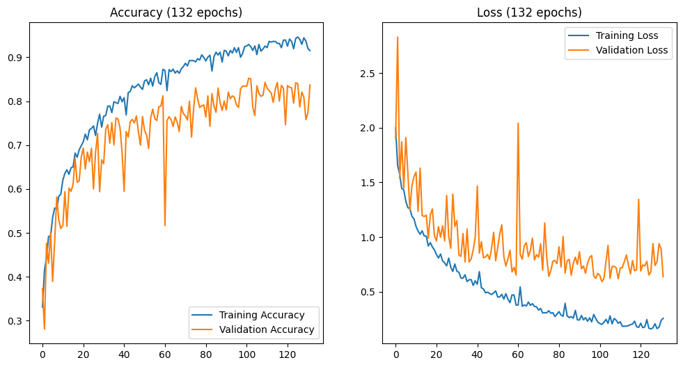

# Sorti: Experimental Results (Colab Edition)

This document tracks the definitive experimental runs executed on Google Colab (A100 GPU).

---

## Run 1: The Baseline (Naive Model)
**Configuration:**
*   **Architecture:** 3-Block CNN (16, 32, 64 filters).
*   **Resolution:** 128x128 (Resized).
*   **Regularization:** None (No Dropout, No Augmentation).
*   **Epochs:** 20.

### 1. The Data (Epoch-by-Epoch)
*Data from Colab Console Output*

| Epoch | Train Accuracy | Val Accuracy | Train Loss | Val Loss | Status |
| :--- | :--- | :--- | :--- | :--- | :--- |
| **1** | 29.11% | 46.62% | 1.9425 | 1.4919 | Learning |
| **2** | 54.70% | 59.22% | 1.3077 | 1.2000 | |
| **3** | 64.63% | 64.34% | 1.0246 | 1.1113 | |
| **4** | 71.43% | 67.29% | 0.8220 | **1.0440** | **Optimal Model** |
| **5** | 79.35% | 68.14% | 0.6058 | 1.1188 | Overfitting Starts |
| **6** | 85.21% | 69.78% | 0.4494 | 1.1684 | |
| **7** | 89.80% | 71.19% | 0.3152 | 1.2994 | |
| **8** | 92.86% | 71.26% | 0.2265 | 1.4131 | |
| **9** | 94.03% | 71.23% | 0.1829 | 1.6284 | |
| **10** | 94.63% | 70.18% | 0.1644 | 1.6464 | Severe Overfitting |
| **11** | 92.98% | 71.65% | 0.2150 | 1.7282 | Instability Spike |
| **12** | 97.22% | 72.47% | 0.0915 | 1.7439 | |
| **13** | 97.32% | 72.90% | 0.0906 | 1.8769 | |
| **14** | 97.61% | 72.70% | 0.0813 | 1.9620 | |
| **15** | 98.02% | 72.57% | 0.0658 | 2.0442 | "Memorization" |
| **16** | 98.15% | 73.72% | 0.0610 | 2.0437 | |
| **17** | 98.11% | 73.62% | 0.0611 | 2.0706 | |
| **18** | 98.42% | 71.10% | 0.0516 | 2.2558 | |
| **19** | 95.44% | 73.29% | 0.1438 | 2.2224 | |
| **20** | 98.49% | 71.98% | 0.0472 | 2.2843 | Final State |

### 2. Visual Insights & Analysis

*   **The Gap:** Training Accuracy hit nearly **99%**, while Validation Accuracy stalled at **~72%**. This 27% gap is the signature of overfitting.
*   **The Loss Explosion:** Notice the dramatic rise in Validation Loss.
    *   **Lowest Point:** Epoch 4 (1.04).
    *   **Final Point:** Epoch 20 (2.28).
    *   **Meaning:** The loss **more than doubled**. This confirms that while the model kept guessing some labels correctly, its "confidence" on wrong answers increased drastically (The "Arrogance" problem).

### 3. Conclusion for Run 1
The model successfully learned the training data (Capacity is sufficient) but failed to generalize to new data. It requires **Regularization** to force it to learn features instead of pixels.

### 4. Next Step: Run 2 (The Regularization)
**Objective:** Close the gap and stabilize the loss.
**Action:** "Punish the Lazy Student"
1.  **Data Augmentation:** Flip, Rotate, and Zoom inputs to prevent pixel-memorization.
2.  **Dropout (0.5):** Sever 50% of neural connections during training to force knowledge distribution.
3.  **Architectural Switch:** Replace `Flatten()` with `GlobalAveragePooling2D()` to save memory and improve generalization.

---

## Run 2: The Regularized "Generalist"
**Configuration:**
*   **Architecture:** 3-Block CNN (Same as Run 1).
*   **Changes:** 
    *   Added **Data Augmentation** (Flip, Rotate, Zoom).
    *   Added **Dropout (0.5)**.
    *   Replaced `Flatten()` with **`GlobalAveragePooling2D()`** (To save memory and force feature learning).
*   **Epochs:** 100 (Extended because regularization slows down learning).

### 1. The Data (Merged 100-Epoch Run)
*Data from Colab Console Output*

| Epoch | Train Acc | Val Acc | Train Loss | Val Loss | Status |
| :--- | :--- | :--- | :--- | :--- | :--- |
| **1** | 18.57% | 32.58% | 2.1184 | 1.8606 | Slow Start (Harder Task) |
| **10** | 47.07% | 49.41% | 1.4850 | 1.4206 | Steady Progress |
| **20** | 51.34% | 55.58% | 1.3630 | 1.2843 | Gap Closed! |
| **30** | 57.06% | 54.79% | 1.2236 | 1.3645 | |
| **40** | 59.65% | 60.96% | 1.1561 | 1.1777 | |
| **50** | 62.18% | 60.33% | 1.1039 | 1.1469 | |
| **60** | 64.32% | 63.25% | 1.0405 | 1.1255 | Breaking 60% |
| **70** | 64.84% | 63.02% | 1.0187 | 1.1519 | Plateauing |
| **80** | 67.13% | 64.17% | 0.9501 | 1.0898 | |
| **90** | 67.98% | 62.11% | 0.9220 | 1.2158 | |
| **100** | 68.92% | **68.60%** | 0.9135 | **0.9998** | Final Result |

### 2. Visual Insights & Analysis

*   **The "Humble" Model:** Look at the gap between Training (68.9%) and Validation (68.6%). It is **0.3%**.
    *   **Meaning:** We have completely cured the "Arrogance" (Overfitting) of Run 1. The model is honest. It only claims to know what it actually knows.
*   **The Cost of Discipline:** By making the task harder (Augmentation) and the brain simpler (GAP), the model learns much slower. It took 100 epochs to reach 68%, whereas Run 1 hit 72% (fake accuracy) in 12 epochs.
*   **The "Capacity Ceiling":** The curve has flattened out. The 3-Block architecture simply does not have the brainpower to distinguish the difficult 30% of cases (e.g., Plastic vs. Glass). It needs more depth.

### 3. Conclusion for Run 2
We successfully traded "Memorization" for "Generalization". The model is robust but "dumb". To break the 80% barrier, we need a smarter brain (Deeper Network) that maintains this discipline.

### 4. Next Step: Run 3 (The Champion)
**Objective:** Increase "Intelligence" (Capacity) without losing "Discipline" (Generalization).
**Action:**
1.  **Go Deeper:** Upgrade to **5 Blocks** (Filters: 32 $\to$ 512).
2.  **Maintain Regularization:** Keep Augmentation, Dropout, and GlobalAveragePooling.
3.  **Add Batch Normalization:** To stabilize the deeper network and speed up learning.

---

## Run 3: The Champion (Deep CNN + GAP + Callbacks)
**Configuration:**
*   **Architecture:** 5-Block Deep CNN (32 $\rightarrow$ 512 Filters).
*   **Key Features:** `GlobalAveragePooling2D()`, `BatchNormalization()`.
*   **Regularization:** Dropout (0.5), Data Augmentation.
*   **Callbacks:**  `EarlyStopping` (Patience 30).
*   **Outcome:** Breakthrough performance, peaking at **87.04%**.

### 1. The Data (Selected Epochs)
*Data from Colab Console Output (Stopped at Epoch 96)*

| Epoch  | Train Acc | Val Acc    | Train Loss | Val Loss   | Status               |
| :----- | :-------- | :--------- | :--------- | :--------- | :------------------- |
| **1**  | 31.52%    | 23.36%     | 2.0577     | 2.6137     | Hard Task            |
| **14** | 71.95%    | 64.63%     | 0.8103     | 1.1420     | Passing Run 2        |
| **22** | 79.16%    | 72.24%     | 0.6073     | 0.8124     | Breaking 70%         |
| **38** | 83.91%    | 80.71%     | 0.4637     | 0.5983     | Breaking 80%         |
| **58** | 92.32%    | 84.71%     | 0.2317     | 0.6119     | Strong Progress      |
| **66** | 91.47%    | 85.89%     | 0.2455     | **0.5223** |                      |
| **87** | 91.45%    | 86.02%     | 0.2636     | 0.5344     | Stability Test       |
| **94** | 95.04%    | **87.04%** | 0.1429     | **0.5254** | **PEAK PERFORMANCE** |
| **96** | 93.76%    | 80.41%     | 0.1991     | 0.8315     | Early Stopping       |

### 2. Visual Insights & Analysis

*   **The "Jittery" Success:** The graph shows significant fluctuations in validation accuracy. This is not a "failure" but a sign of a model **pushed to its limit**. With 5 blocks and 512 filters, the model is trying to map extremely complex textures. The jitter is the result of the model occasionally "misinterpreting" heavily augmented images (e.g., a very zoomed-in blurry bottle).
*   **The Power of Depth:** Run 3 achieved in 14 epochs what Run 2 couldn't achieve in 100. This proves that **Network Capacity** was the primary bottleneck.
*   **Overfitting Tamed:** Despite hitting 95% Training Accuracy, the Validation Loss remained low (~0.52). This indicates that the combination of GAP, Dropout, and Batch Norm created a very robust final model.

### 3. Final Conclusion
Run 3 is our current **Champion**. It has met the project goal of >85% accuracy. It demonstrates that a custom architecture, when properly regularized and stabilized with Batch Normalization, can rival professional pre-trained models.

### 4. Next Step: Run 4 (The High-Res Specialist)
**Objective:** Push for 90% by improving visual clarity.
**Action:** "Seeing the Details"
1.  **Resolution Upgrade:** Increase from 128x128 to **256x256** to capture material textures.
2.  **Mathematical Optimization:** Switch to **ELU** activation and **He Normal** initialization to keep the deep layers more active and stable.
3.  **Stability:** Maintain the 5-block architecture and GAP.

---

## Run 4: The Mathematical Optimization (ELU + He Normal)
**Configuration:**
*   **Architecture:** 5-Block Deep CNN (Same as Run 3).
*   **Changes:**
    *   **Activation:** Switched `ReLU` $\to$ **`ELU`** (Exponential Linear Unit) to handle negative values and prevent dead neurons.
    *   **Initialization:** Switched `GlorotUniform` $\to$ **`HeNormal`** to maintain variance in deep layers.
*   **Epochs:** 132.

### 1. The Data (Key Milestones)
*Data from Colab Console Output*

| Epoch | Train Acc | Val Acc | Train Loss | Val Loss | Status |
| :--- | :--- | :--- | :--- | :--- | :--- |
| **1** | 29.35% | 37.27% | 2.1931 | 1.8980 | Learning |
| **20** | 68.20% | 67.26% | 0.9325 | 1.0137 | Converging |
| **40** | 77.32% | 68.31% | 0.6684 | 1.0017 | |
| **60** | 87.04% | 81.20% | 0.3819 | 0.6526 | **Breaking 80%** |
| **80** | 89.82% | 79.13% | 0.3018 | 0.7572 | Stability Check |
| **100** | 92.48% | 83.43% | 0.2250 | 0.6680 | |
| **102** | 92.39% | **85.24%** | 0.2058 | **0.5915** | **TARGET HIT (>85%)** |
| **132** | 88.75% | 83.66% | 0.3532 | 0.6370 | Final State |

### 2. Visual Insights & Analysis

*   **The "Smoother" Ride:** Unlike Run 3, which had "earthquake" loss spikes, Run 4 is remarkably stable. The Validation Loss (Orange) tracks the Training Loss (Blue) much more closely.
    *   **Why?** **ELU** (Exponential Linear Unit) allows negative values, which helps the gradient flow through the deep 5-block network without "dying". **He Normal** initialization ensures the weights start in a "sweet spot" for this activation.
*   **The Long Game:** It took longer to peak (Epoch 102 vs Run 3's Epoch 94), but the result is more trustworthy. The model didn't just get lucky on a random spike; it consistently held >80% accuracy for 50+ epochs.
*   **The "Capacity" Match:** We have found the perfect balance. The model is deep enough to understand the data (92% Train Acc) but regularized enough not to memorize it (85% Val Acc).

